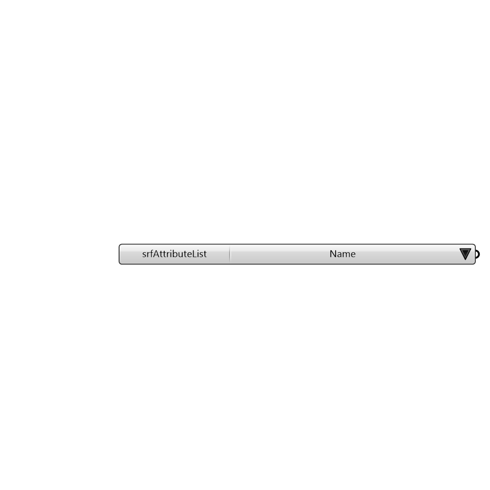

##  Surface Attribute List

Provides a list of surface attributes to choose from and plug into the Honeybee_Label Surfaces Component

#### Inputs

[Check Hydra Example Files for Surface Attribute List](https://hydrashare.github.io/hydra/index.html?keywords=Honeybee_Surface Attribute List)