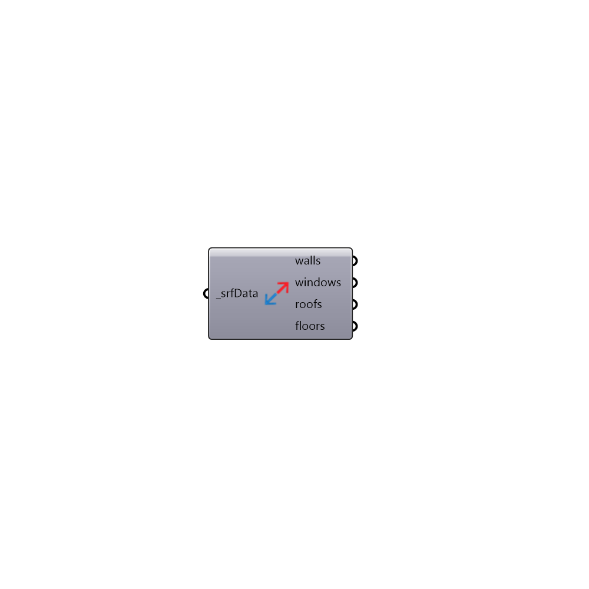

##  Surface Data Based On Type - [[source code]](https://github.com/ladybug-tools/honeybee-legacy/tree/master/src/Honeybee_Surface%20Data%20Based%20On%20Type.py)

Use this component to separate grafed lists of surface data that come out of the "Honeybee_Read EP Surface Result" component based on rough surface type.
 -
 

#### Inputs
* ##### srfData [Required]
Any surface data out of the "Honeybee_Read EP Surface Result" component.

#### Outputs
* ##### walls
A list of walls as breps.
* ##### windows
A list of windows as breps.
* ##### roofs
A list of roofs as breps.
* ##### floors
A list of floors as breps.

[Check Hydra Example Files for Surface Data Based On Type](https://hydrashare.github.io/hydra/index.html?keywords=Honeybee_Surface Data Based On Type)