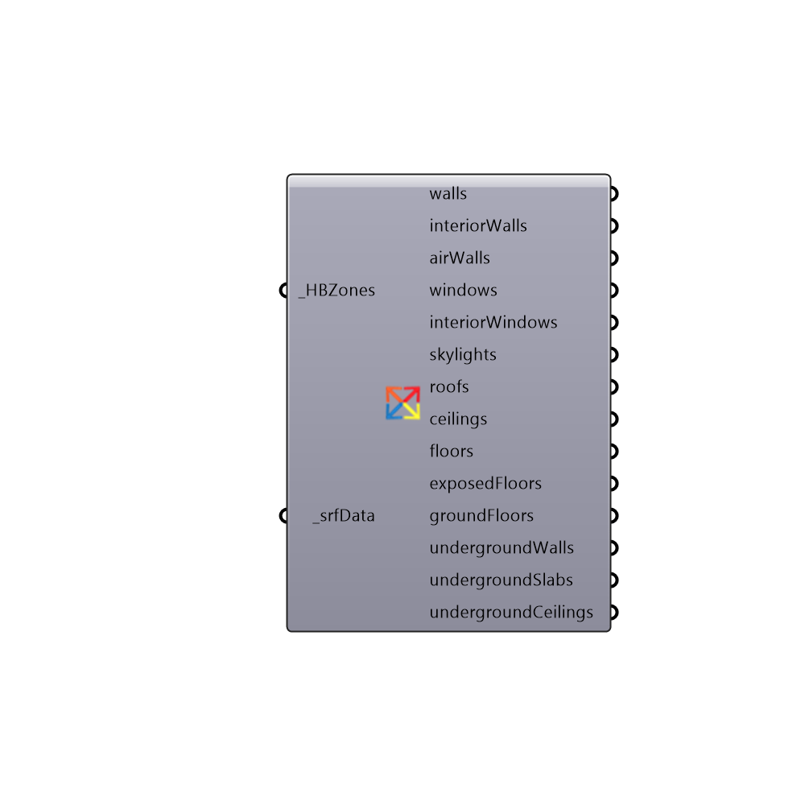

##  Surface Data Based On Type Detailed - [[source code]](https://github.com/mostaphaRoudsari/honeybee/tree/master/src/Honeybee_Surface%20Data%20Based%20On%20Type%20Detailed.py)

Use this component to separate grafed lists of surface data that come out of the "Honeybee_Read EP Surface Result" component based on rough surface type.  This component separates all surface types but takes sevaral seconds to load and requires HBZones.  For a quicker splitting of data, use the "Honeybee_Surface Data Based On Type" component.
 -
 

#### Inputs
* ##### HBZones [Required]
Honeybee Zone
* ##### srfData [Required]
Script variable decomposeByType

#### Outputs
* ##### walls
A grafted list of surface data for walls.
* ##### interiorWalls
A grafted list of surface data for interior walls.
* ##### airWalls
A grafted list of surface data for air walls.
* ##### windows
A grafted list of surface data for exterior windows.
* ##### interiorWindows
A grafted list of surface data for interior windows.
* ##### skylights
A grafted list of surface data for skylights.
* ##### roofs
A grafted list of surface data for roofs.
* ##### ceilings
A grafted list of surface data for ceilings.
* ##### floors
A grafted list of surface data for floors.
* ##### exposedFloors
A grafted list of surface data for exposed floors.
* ##### groundFloors
A grafted list of surface data for ground floors.
* ##### undergroundWalls
A grafted list of surface data for underground walls.
* ##### undergroundSlabs
Script variable decomposeByType
* ##### undergroundCeilings
A grafted list of surface data for underground ceilings.

[Check Hydra Example Files for Surface Data Based On Type Detailed](https://hydrashare.github.io/hydra/index.html?keywords=Honeybee_Surface Data Based On Type Detailed)