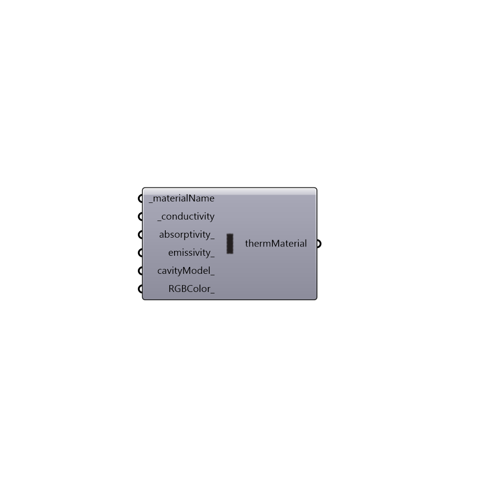

##  Therm Material

Use this component to create a custom THERM material, which can be plugged into the "Honeybee_Create Therm Polygons" component.
 -
 

#### Inputs
* ##### materialName [Required]
A text name for your THERM Material.
* ##### conductivity [Required]
A number representing the conductivity of the THERM material in W/m-K.
* ##### absorptivity [Optional]
A number between 0 and 1 that represents the solar absorptivity of the material. The default is set to 0.5.
* ##### emissivity [Optional]
A number between 0 and 1 that represents the emissivity of the material. The default is set to 0.9.
* ##### type [Optional]
An integer that represents the type of material.  The defaul is set to 0 - solid.  Choose from the following options:
 0 - Solid material
 1 - Gas material
* ##### RGBColor [Optional]
An optional color to set the color of the material when you import it into THERM.

#### Outputs
* ##### thermMaterial
A therm material that can be plugged into the "Honeybee_Create Therm Polygons" component.

[Check Hydra Example Files for Therm Material](https://hydrashare.github.io/hydra/index.html?keywords=Honeybee_Therm Material)