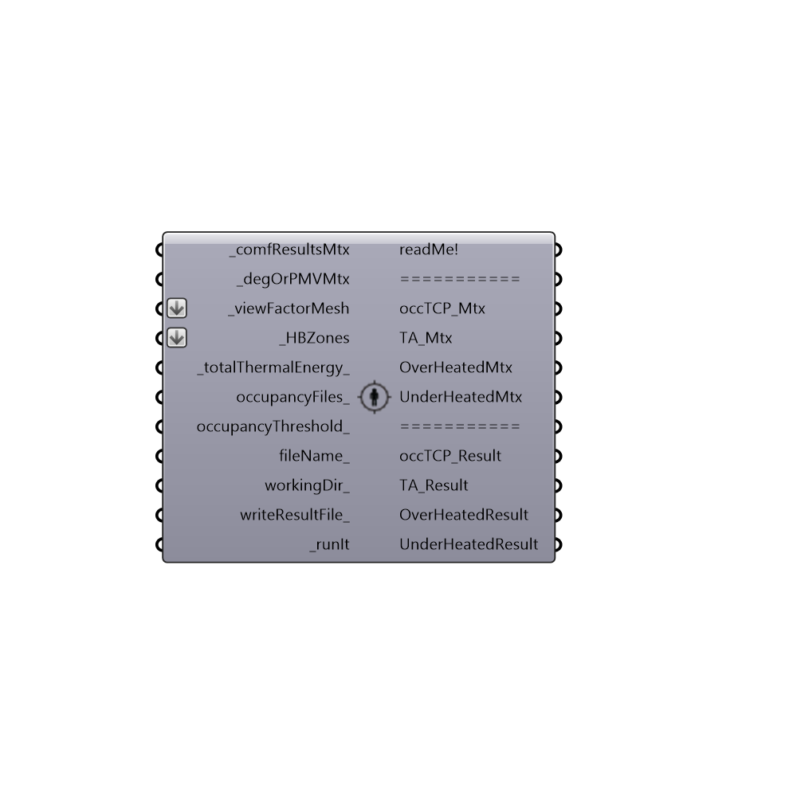

##  Thermal Autonomy Analysis - [[source code]](https://github.com/ladybug-tools/honeybee-legacy/tree/master/src/Honeybee_Thermal%20Autonomy%20Analysis.py)

Use this component to calculate 'Occupied Thermal Comfort Percent' (occTCP) and 'Thermal Autonomy' (TA) from the resultd of a Microclimate Map Analysis.
 _
 'Occupied Thermal Comfort Percent' (occTCP) is defined here as the the percent of occupied time where a point of space meets or exceeds a given set of thermal comfort acceptability criteria.
 Precedents for Thermal Comfort Percent (TCP) as a metric to spatially evaluate the desirability of a given space can be found in the PhD thesis of Tarek Rakha (http://www.tarekrakha.com/#/research/).
 _
 'Thermal Autonomy' (TA) is defined here as the the percent of occupied time where a point of space meets or exceeds a given set of thermal comfort acceptability criteria through passive means only.
 Precedents for Thermal Autonomy (TA) as a metric to evaluate the passive operation of a given space can be found in the work of Brendon Levitt.
 Levitt, B.; Ubbelohde, M.; Loisos, G.; Brown, N.  Thermal Autonomy as Metric and Design Process. Loisos + Ubbelohde, Alameda, California, California College of the Arts, San Francisco. 2013.
 (http://www.coolshadow.com/research/Levitt_Thermal%20Autonomy%20as%20Metric%20and%20Design%20Process.pdf)
 -
 

#### Inputs
* ##### comfResultsMtx [Required]
A comfort matrix (adaptive, PMV or Outdoor) output from either the 'Honeybee_Microclimate Map Analysis' component or the 'Honeybee_Read Microclimate Matrix' component.
* ##### degOrPMVMtx [Required]
The degreeFromTargetMtx, PMV_Mtx, or DegFromNeutralMtx from either the 'Honeybee_Microclimate Map Analysis' component or the 'Honeybee_Read Microclimate Matrix' component.
* ##### viewFactorMesh [Required]
The list of view factor meshes that comes out of the  "Honeybee_Indoor View Factor Calculator".
* ##### HBZones [Required]
The HBZones out of any of the HB components that generate or alter zones.  Note that these should ideally be the zones that are fed into the Run Energy Simulation component as surfaces may not align otherwise.  Zones read back into Grasshopper from the Import idf component will not align correctly with the EP Result data.
* ##### totalThermalEnergy [Default]
The totalThermalEnergy output from the "Honeybee_Read EP Result" component.  If no data tree is connected here, it will be assumed that all zones are completely passive and only occupancy will be taken into accout for the Thermal Autonomy calculation.
* ##### occupancyFiles [Optional]
Optional occupancy CSV files that will be used to set the occupied period of the Thermal Autonomy calculation.  These can be either EnergyPlus CSV schedules made with the 'Honeybee_Create CSV Schedule' component or Daysim occupancy files made with the 'Honyebee_Daysim Occupancy Generator' component (the two produce files of the same format).  This can be either a list of files that match the connected HBZones or a single occupancy file to be used for all connected zones.  By default, this component will create the occupancy peirod from the occupancy schedule assigned to the connected _HBzones so you should usually not have need for this input and should instead change the HBZone occupancy schedule before running the simulation.
* ##### occupancyThreshold [Optional]
An optional number between 0 and 1 that sets the minimum occupancy at which a zone is considered occupied.  This is done as the default occupancy is taken from the HBZone's occupancy schedules and, in some cases this value is low enough to ignore for the sake of calculating thermal autonomy.  The default is set to 0 such that any time when the zones are occpied count towards the values calculated by this component.
* ##### fileName [Optional]
An optional file name for the result files as a string.
* ##### workingDir [Optional]
An optional working directory on your system. Default is set to C:\Ladybug
* ##### writeResultFile [Optional]
Set to 1 or 'True' to have the component write all results into CSV result files and set to 0 or 'False' to not have the component write these files.  The default is set to 'True' as these simulations can be long and you usually want a copy of your results.  You may want to set it to 'False' if you are just scrolling through key hours and want the fastest run possible.  Set to 2 if you want the component to only write the results for the TCPocc and TCA matrices.
* ##### runIt [Required]
Set boolean to "True" to run the component and calculate comfort autonomy.

#### Outputs
* ##### readMe!
...
* ##### occTCP_Mtx
A python matrix containing the 'Themal Comfort Percent' (TCP) values for only the occupied period of the model.  Connect this to the 'Honeybee_Visualize Microclimate Map' component in order to display the data. 'Occupied Thermal Comfort Percent' (occTCP) is defined here as the the percent of occupied time where a point of space meets or exceeds a given set of thermal comfort acceptability criteria.  This is essentially the same thing as the adaptComfMtx, PMVComfMtx, or outdoorComfMtx but with the unoccupied hours discounted.
* ##### TA_Mtx
A python matrix containing the 'Thermal Autonomy' (TA) values for each of the faces of the connected _viewFactorMesh. Connect this to the 'Honeybee_Visualize Microclimate Map' component in order to display the data. 'Thermal Autonomy' (TA) is defined here as the the percent of occupied time where a point of space meets or exceeds a given set of thermal comfort acceptability criteria through passive means only.
* ##### OverHeatedMtx
A python matrix containing the overheated hours for each of the faces of the connected _viewFactorMesh.  Connect this to the 'Honeybee_Visualize Microclimate Map' component in order to display the data. Overheated hours are essentially the number of occupied hours that a point is warmer than that specified by a given set of thermal comfort acceptability criteria.
* ##### UnderHeatedMtx
A python matrix containing the underheated hours for each of the faces of the connected _viewFactorMesh.  Connect this to the 'Honeybee_Visualize Microclimate Map' component in order to display the data. Underheated hours are essentially the number of occupied hours that a point is colder than that specified by a given set of thermal comfort acceptability criteria.
* ##### occTCP_Result
A csv file address containing the 'Themal Comfort Percent' (TCP) values for only the occupied period of the model.
* ##### TA_Result
A csv file address containing the 'Thermal Autonomy' (TA) values for each of the faces of the connected _viewFactorMesh.
* ##### OverHeatedResult
A csv file address containing the overheated hours for each of the faces of the connected _viewFactorMesh.
* ##### UnderHeatedResult
A csv file address containing the underheated hours for each of the faces of the connected _viewFactorMesh.

[Check Hydra Example Files for Thermal Autonomy Analysis](https://hydrashare.github.io/hydra/index.html?keywords=Honeybee_Thermal Autonomy Analysis)