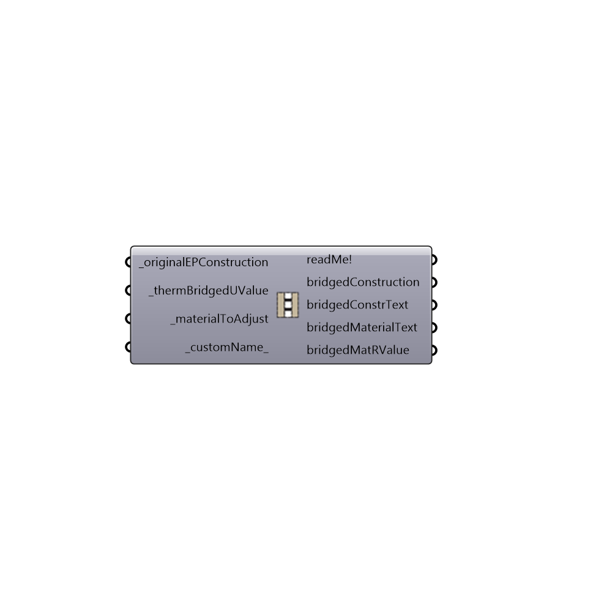

##  Thermally Bridged EP Construction - [[source code]](https://github.com/mostaphaRoudsari/honeybee/tree/master/src/Honeybee_Thermally%20Bridged%20EP%20Construction.py)

Use this component to adjust the U-value an EP construction without any thermal bridges to account for birdges by adjusting the condutivity of one of the materials.
 -
 

#### Inputs
* ##### originalEPConstruction [Required]
An EP construction that does not have any thermal bridges associated with it.
* ##### thermBridgedUValue [Required]
The U-value in SI units (W/m2-K) that you would like the whole construction assembly to be adjusted to.  This U-value should include the resistance of air films on either side of the construction assembly, which is included by default in the output from THERM simulations.
* ##### materialToAdjust [Required]
The name of a material within the _originalEPConstruction that you would like to have the conductivity adjusted to meet the _thermBridgedUValue.
* ##### customName [Default]
An optional custom name to be added to the new thermally bridged material and construction.

#### Outputs
* ##### readMe!
...
* ##### bridgedConstruction
A thermally bridged construction that can be applied to HBZones and HBSurfaces for energy simulations.
* ##### bridgedConstrText
The IDF text that defines the thermally bridged construction that has been written to the memory of the document.
* ##### bridgedMaterialText
The IDF text that defines the thermally bridged material within the construction.
* ##### bridgedMatRValue
The R-value of the newly created thermally bridged material.

[Check Hydra Example Files for Thermally Bridged EP Construction](https://hydrashare.github.io/hydra/index.html?keywords=Honeybee_Thermally Bridged EP Construction)