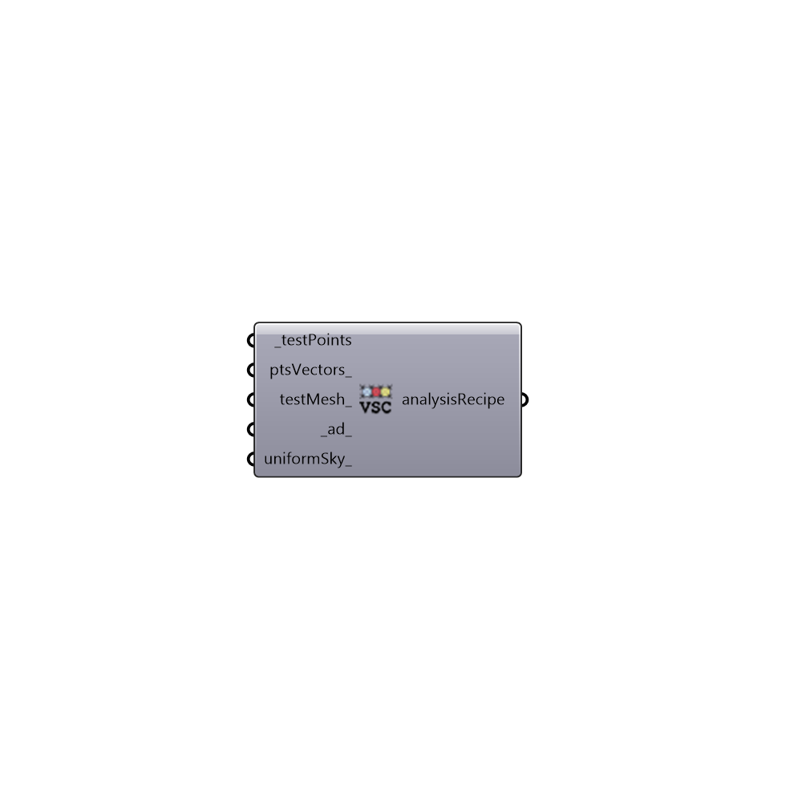

##  Vertical Sky Component - [[source code]](https://github.com/mostaphaRoudsari/honeybee/tree/master/src/Honeybee_Vertical%20Sky%20Component.py)

Analysis Recipie for Vertical Sky Component, which is typically used to evaluate daylight and sky access in urban areas.
 _
 The Vertical Sky Component (VSC) is described by the UK Building Research Establishment (BRE) as the ratio of the direct sky illuminance falling on the vertical wall at a reference point, to the simultaneous horizontal illuminance under an unobstructed sky [Littlefair, 1991]. It also states that the Standard CIE Overcast Sky model is to be used for the sky illuminance distribution. This means that the reference value for the VSC percentage is effectively the unobstructed horizontal sky component.
 _
 The calculation performed by this component comes from this discussion on the RADIANCE forum: http://www.radiance-online.org/pipermail/radiance-general/2006-September/004017.html
 -
 

#### Inputs
* ##### testPoints [Required]
Test points
* ##### ptsVectors [Optional]
Point vectors
* ##### testMesh [Optional]
Script variable verticalSkyComponent
* ##### ad [Default]
Number of ambient divisions. "The error in the Monte Carlo calculation of indirect illuminance will be inversely proportional to the square root of this number. A value of zero implies no indirect calculation."
* ##### uniformSky [Optional]
Set to true to run the study under a CIE uniform sky. Default is set to cloudy sky

#### Outputs
* ##### analysisRecipe
Recipe for vertical sky component

[Check Hydra Example Files for Vertical Sky Component](https://hydrashare.github.io/hydra/index.html?keywords=Honeybee_Vertical Sky Component)