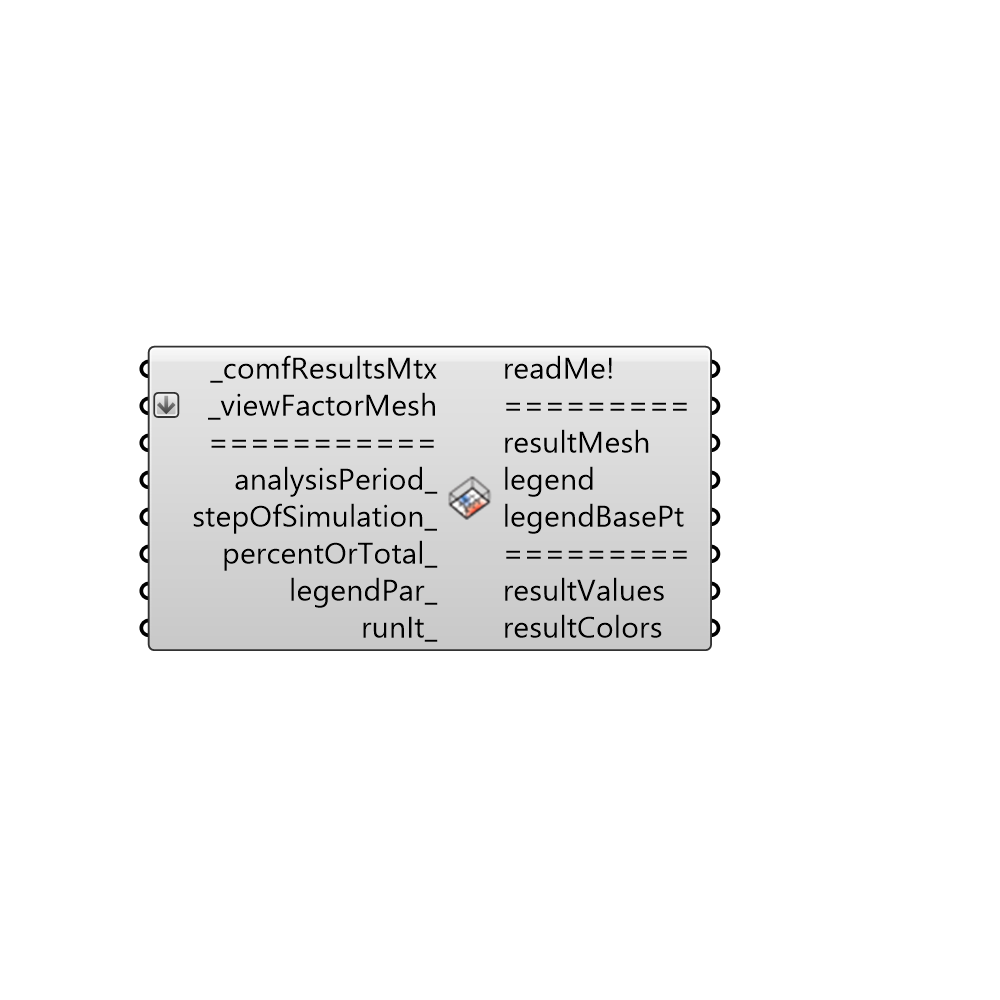

##  Visualize Microclimate Map - [[source code]](https://github.com/mostaphaRoudsari/honeybee/tree/master/src/Honeybee_Visualize%20Microclimate%20Map.py)

Use this component to produce a colored mesh from a comfResultsMtx.
 -
 

#### Inputs
* ##### comfResultsMtx [Required]
Any matrix output from the 'Honeybee_Microclimate Map Analysis' component, the 'Honeybee_Thermal Comfort Autonomy Analysis' component, or the 'Honeybee_Read Microclimate Matrix' component.
* ##### viewFactorMesh [Required]
The list of view factor meshes that comes out of the  'Honeybee_Indoor View Factor Calculator'.  These will be colored with result data.
* ##### analysisPeriod [Optional]
Optional analysisPeriod_ to take a slice out of the data stream.  Note that that connecting a value to 'stepOfSimulation_' will override this input.
* ##### stepOfSimulation [Optional]
Optional interger to select out a step of the simulation to color the mesh with.  Connecting a value here will override the analysisPeriod_ input.
* ##### percentOrTotal [Optional]
Set to 'True' to have the component compute comfort values as a percent of occupied hours or all hours.  Set to 'False' to have the component compute comfort values as a total number of hours.  The default is set to 'True' to calculate comfort as a percent.  Note that this input only works for comfort matrices and not temperature ones.
* ##### legendPar [Optional]
Optional legend parameters from the Ladybug Legend Parameters component.
* ##### runIt [Optional]
Set boolean to "True" to run the component and produce a colored mesh from a comfResultsMtx.

#### Outputs
* ##### readMe!
...
* ##### resultMesh
A list of colored meshes showing the results form the comfResultsMtx.
* ##### legend
A legend for the colored mesh. Connect this output to a grasshopper "Geo" component in order to preview the legend spearately in the Rhino scene.
* ##### legendBasePt
The legend base point, which can be used to move the legend with the grasshopper "move" component.
* ##### resultValues
The values of results that are being used to color the results.
* ##### resultColors
The colors used for each mesh face.

[Check Hydra Example Files for Visualize Microclimate Map](https://hydrashare.github.io/hydra/index.html?keywords=Honeybee_Visualize Microclimate Map)