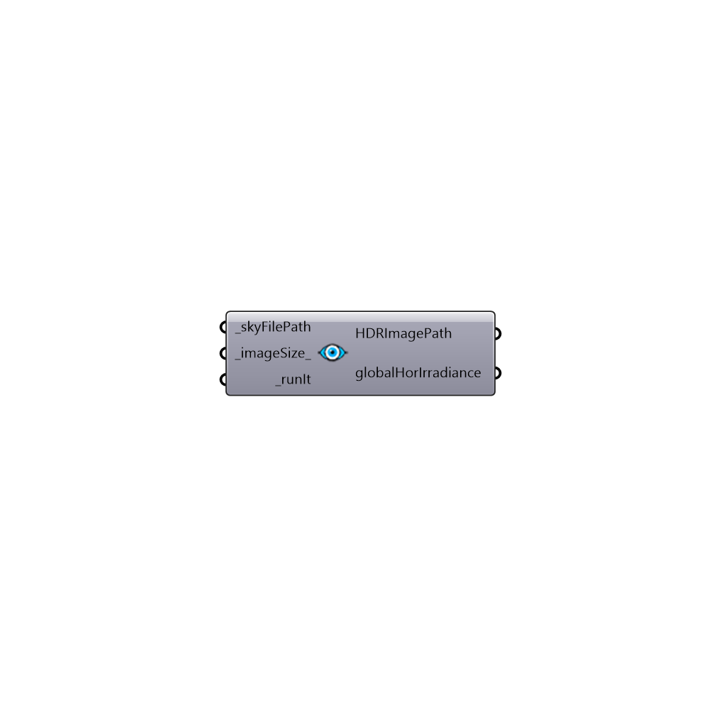

##  Watch The Sky - [[source code]](https://github.com/ladybug-tools/honeybee-legacy/tree/master/src/Honeybee_Watch%20The%20Sky.py)

Watch The Sky
 -
 

#### Inputs
* ##### skyFilePath [Required]
Path to a radiance sky file
* ##### imageSize [Default]
Optional input for size of the imgae in pixles. Default value is 500 px
* ##### runIt [Required]
Set to true to run the analysis

#### Outputs
* ##### HDRImagePath
Path to the result HDR file
* ##### globalHorIrradiance
Global horizontal irradiance for an upstructed test point under this sky (wh/m2) - In case you're watching the cumulative sky the number is in (KWh/m2).

[Check Hydra Example Files for Watch The Sky](https://hydrashare.github.io/hydra/index.html?keywords=Honeybee_Watch The Sky)