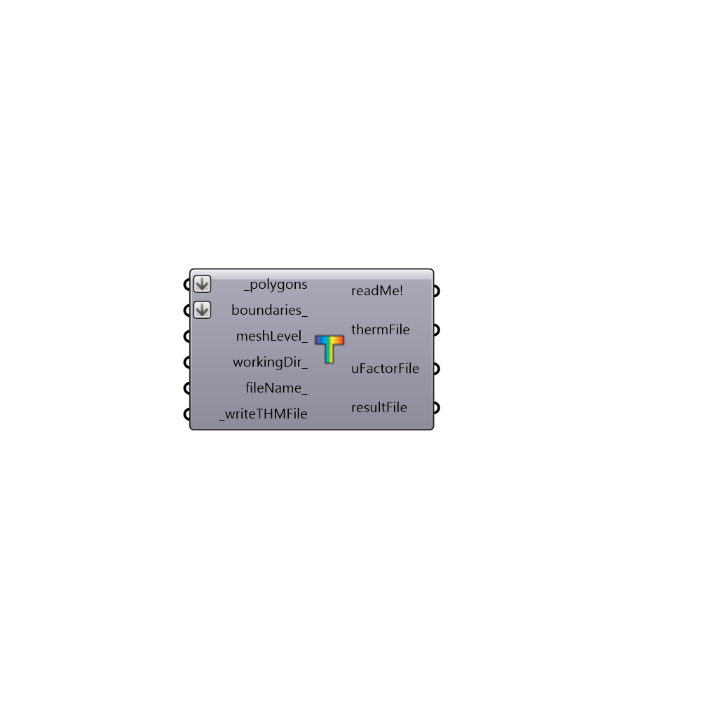

##  Write THERM File

Use this component to write your THERM polygons and boundary conditions into a therm XML that can be opened ready-to-run in THERM.
 -
 

#### Inputs
* ##### polygons [Required]
A list of thermPolygons from one or more "Honeybee_Create Therm Polygons" components.
* ##### boundaries [Optional]
A list of thermBoundaries from one or more "Honeybee_Create Therm Boundaries" components.
* ##### meshLevel [Optional]
An optional integer to set the mesh level of the resulting exported file.  The default is set to a coarse value of 8, which is the highest level available. If your model is not too complex, you may want to lower this to decrease the runtime.
* ##### workingDir [Optional]
An optional working directory to a folder on your system, into which you would like to write the THERM XML and results.  The default will write these files in into your Ladybug default folder.  NOTE THAT DIRECTORIES INPUT HERE SHOULD NOT HAVE ANY SPACES OR UNDERSCORES IN THE FILE PATH.
* ##### fileName [Optional]
An optional text string which will be used to name your THERM XML.  Change this to aviod over-writing results of previous runs of this component.
* ##### writeTHMFile [Required]
Set to "True" to have the component take your connected UWGParemeters and write them into an XML file.  The file path of the resulting XML file will appear in the xmlFileAddress output of this component.  Note that only setting this to "True" and not setting the output below to "True" will not automatically run the XML through the Urban Weather Generator for you.
* ##### runTHERM [Optional]
Script variable writeTHERM

#### Outputs
* ##### readMe!
...
* ##### thermFile
The file path of the therm XML file that has been generated on your machine.  Open this file in THERM to see your exported therm model.
* ##### resultFile
The file path of the THERM results including the mesh of the therm geometry and the values of temperature / heat flow at each point of the mesh.  Note that this file will not be generated unless runTHERM_ is set to "True" and your calculation is successful.
* ##### uFactorFile
The file path to a therm XML file that is written after the simulation is run.  This file contains all results or U-factors accross their respective tags as well as information that helps place the result mesh in the file above correctly in the Rhino scene. Note that this file will not be generated unless runTHERM_ is set to "True" and your calculation is successful.
* ##### probRegion
Check this output for the problematic regions of your model (where holes in the model are).

[Check Hydra Example Files for Write THERM File](https://hydrashare.github.io/hydra/index.html?keywords=Honeybee_Write THERM File)