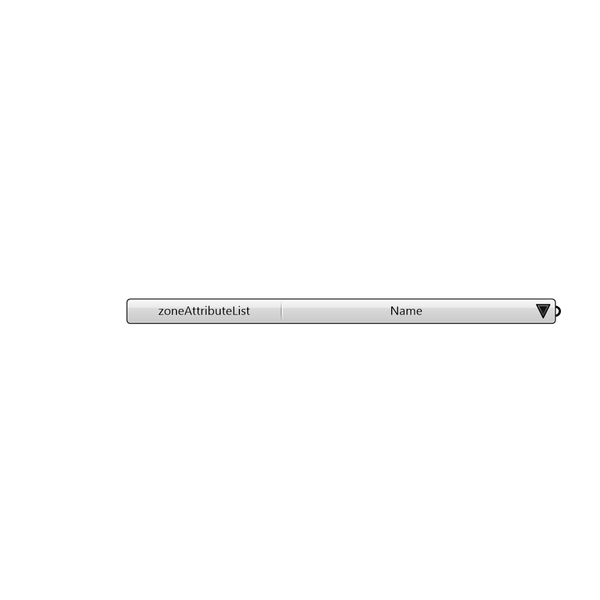

##  Zone Attribute List - [[source code]](https://github.com/ladybug-tools/honeybee-legacy/tree/master/src/Honeybee_Zone%20Attribute%20List.py)

Provides a list of preset values to choose from

#### Inputs

[Check Hydra Example Files for Zone Attribute List](https://hydrashare.github.io/hydra/index.html?keywords=Honeybee_Zone Attribute List)