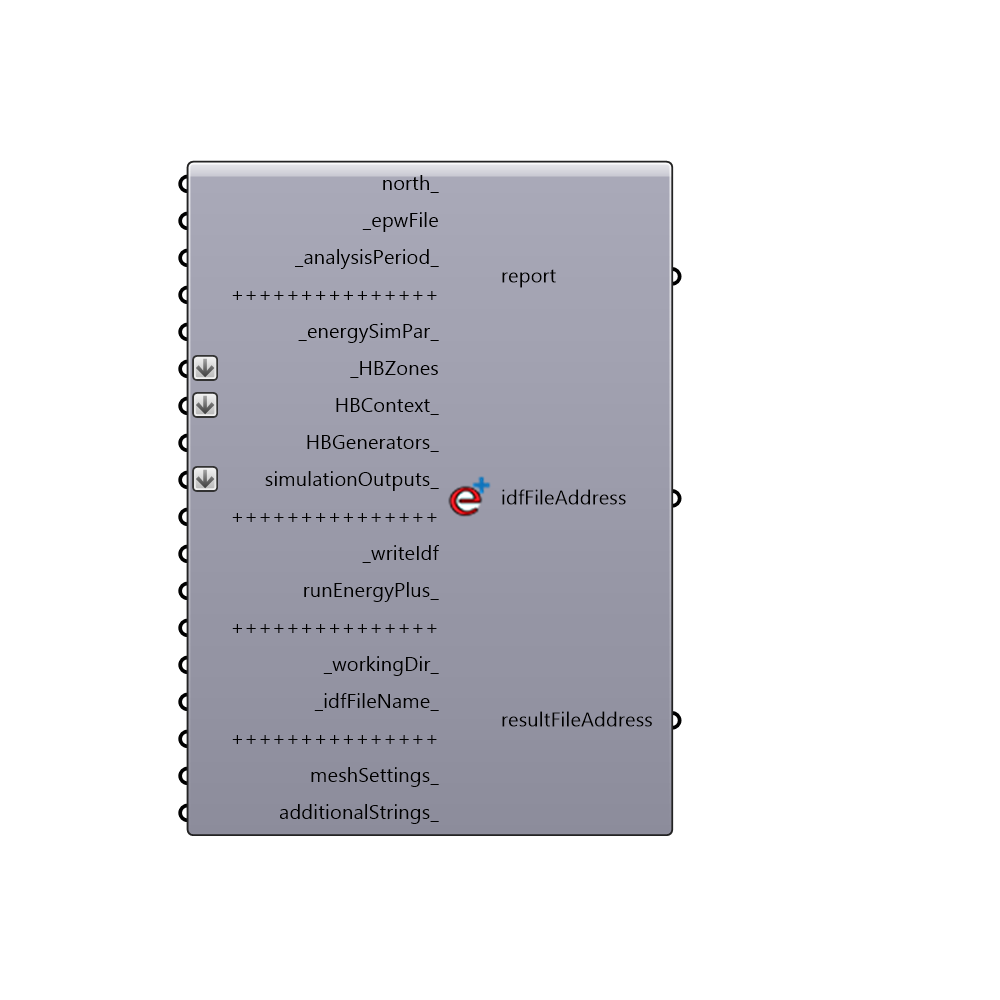

##   Run Energy Simulation

Use this component to export HBZones into an IDF file, and run them through EnergyPlus.
 _
 The component outputs the report from the simulation, the file path of the IDF file, and the CSV result file from the EnergyPlus run.
 -
 

#### Inputs
* ##### north [Optional]
Input a vector to be used as a true North direction for the energy simulation or a number between 0 and 360 that represents the degrees off from the y-axis to make North.  The default North direction is set to the Y-axis (0 degrees).
* ##### epwFile [Required]
An .epw file path on your system as a text string.
* ##### analysisPeriod [Default]
An optional analysis period from the Ladybug_Analysis Period component.  If no Analysis period is given, the energy simulation will be run for the enitre year.
* ##### energySimPar [Default]
Optional Energy Simulation Parameters from the "Honeybee_Energy Simulation Par" component.  If no value is connected here, the simulation will run with the following parameters:
 1 - 6 timeSteps per hour
 2 - A shadow calculation that averages over multiple days (as opposed to running it for each timeStep)
 3 - A shadow calculation frequency of 30 (meaning that the shadow calulation is averaged over every 30 days)
 4 - A maximum of 3000 points used in the shadow calculation. (This may need to be higher if you have a lot of detailed context geometry)
 5 - An colar energy calculation that includes both interior and exterior light reflections.
 6 - A simulation including a zone sizing calculation, a system sizing calculation, a plat sizing calculation, and a full run of the energy use ofver the analysis period.  The simulation is not run for the sizing period by default.
 7 - A system sizing period that runs from the extreme periods of the weather file and not a ddy file.
 8 - City terrian.
* ##### HBZones [Required]
The HBZones that you wish to write into an IDF and/or run through EnergyPlus.  These can be from any of the components that output HBZones.
* ##### HBContext [Optional]
Optional HBContext geometry from the "Honeybee_EP Context Surfaces." component or Honeybee PV gen component.
* ##### HBGenerators [Optional]
Connect the output HBGeneratorSystem from the Honeybee_generationsystem component here to model EnergyPlus Photovoltaic and Wind generator systems in this simulation.
* ##### simulationOutputs [Optional]
A list of the outputs that you would like EnergyPlus to write into the result CSV file.  This can be any set of any outputs that you would like from EnergyPlus, writen as a list of text that will be written into the IDF.  It is recommended that, if you are not expereinced with writing EnergyPlus outputs, you should use the "Honeybee_Write EP Result Parameters" component to request certain types of common outputs.  If no value is input here, this component will automatically request outputs of heating, cooling, lighting, and equipment energy use.
* ##### writeIdf [Required]
Set to "True" to have the component take your HBZones and other inputs and write them into an IDF file.  The file path of the resulting file will appear in the idfFileAddress output of this component.  Note that only setting this to "True" and not setting the output below to "True" will not automatically run the IDF through EnergyPlus for you.
* ##### runEnergyPlus [Optional]
Set to "True" to have the component run your IDF through EnergyPlus once it has finished writing it.  This will ensure that a CSV result file appears in the resultFileAddress output. Set to 2 if you want the analysis to run in background. This option is useful for parametric runs when you don't want to see command shells.
* ##### workingDir [Default]
An optional working directory to a folder on your system, into which your IDF and result files will be written.  NOTE THAT DIRECTORIES INPUT HERE SHOULD NOT HAVE ANY SPACES OR UNDERSCORES IN THE FILE PATH.
* ##### idfFileName [Default]
Optional text which will be used to name your IDF and result files.  Change this to aviod over-writing results of previous energy simulations.
* ##### meshSettings [Optional]
Optional mesh settings for your geometry from any one of the native Grasshopper mesh setting components.  These will be used to change the meshing of curved surfaces before they are run through EnergyPlus (note that meshing of curved surfaces is done since Energyplus is not able to calculate heat flow through non-planar surfaces).  Default Grasshopper meshing is used if nothing is input here but you may want to decrease your calculation time by changing it to Coarse or increase your curvature definition (and calculation time) by making it finer.
* ##### additionalStrings [Optional]
THIS OPTION IS JUST FOR ADVANCED USERS OF ENERGYPLUS.  You can input additional text strings here that you would like written into the IDF.  The strings input here should be complete EnergyPlus objects that are correctly formatted.  You can input as many objects as you like in a list.  This input can be used to write objects into the IDF that are not currently supported by Honeybee.

#### Outputs
* ##### report
Check here to see a report of the EnergyPlus run, including errors.
* ##### idfFileAddress
The file path of the IDF file that has been generated on your machine.
* ##### resultFileAddress
The file path of the CSV result file that has been generated on your machine.  This only happens when you set "runEnergyPlus_" to "True."

[Check Hydra Example Files for  Run Energy Simulation](https://hydrashare.github.io/hydra/index.html?keywords=Honeybee_ Run Energy Simulation)