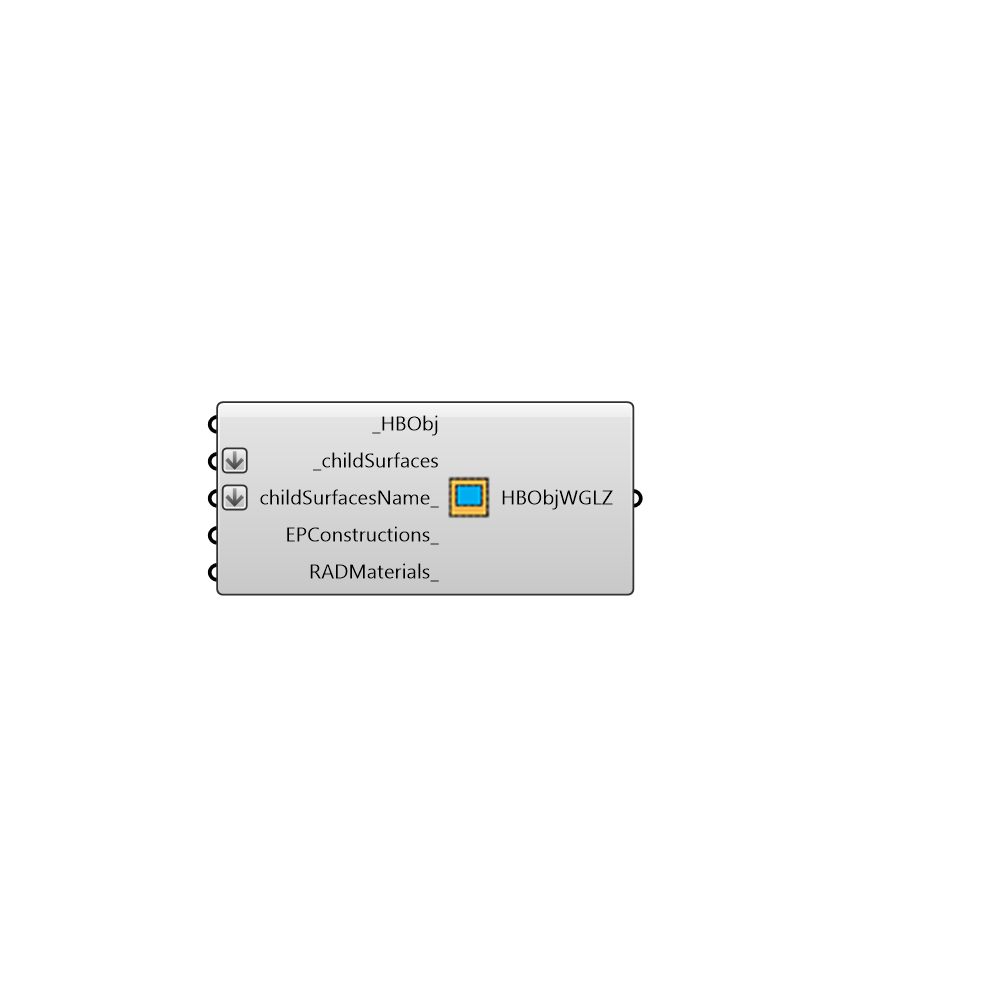

##  addHBGlz - [[source code]](https://github.com/mostaphaRoudsari/honeybee/tree/master/src/Honeybee_addHBGlz.py)

Use this component to add a custom glazing surface to a HBSurface or HBZone.
 -
 

#### Inputs
* ##### HBObj [Required]
A HBZone or HBSurface to which you would like to add a customized glazing surface.
* ##### childSurfaces [Required]
A surface or list of surfaces that represent the custom window(s) that you would like to add.  Note that these surfaces should be co-planar to the connected HBSurface or one of the surfaces of the connected HBZones.
* ##### childSurfacesName [Optional]
An optional list of names for child surfaces. If names are provided the length of names should be the same as _childSurfaces.
* ##### EPConstructions [Optional]
An optional list of EnergyPlus constructions to set the material construction of the window added to the HBSurface or HBZone.  This can be either the name of a window construction from the OpenStudio library (coming out of the 'Honeybee_Call from EP Construction Library' component) or a custom window construction you created from the 'Honeybee_EnergyPlus Construction' component. The list should match with childSurfaces list. In case the list doesn't match the first construction will be used for all surfaces.
* ##### RADMaterials [Optional]
An optional Radiance material to set the material of the window added to the HBSurface or HBZone.  This can be either the name of a window material from the default Radaince library (coming out of the 'Honeybee_Call from Radiance Library' component) or a custom window material you created from any of the Radiance material components (like the 'Honeybee_Radiance Glass Material' component). The list should match with childSurfaces list. In case the list doesn't match the first material will be used for all surfaces.

#### Outputs
* ##### HBObjWGLZ
The Honeybee surface or zone with assigned glazing (in case of success).

[Check Hydra Example Files for addHBGlz](https://hydrashare.github.io/hydra/index.html?keywords=Honeybee_addHBGlz)