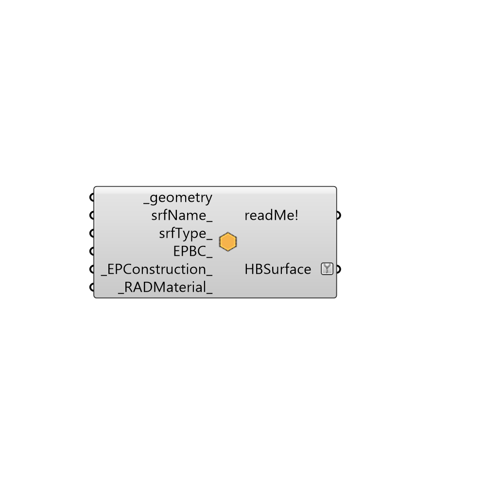

##  createHBSrfs - [[source code]](https://github.com/mostaphaRoudsari/honeybee/tree/master/src/Honeybee_createHBSrfs.py)

Create a Honeybee surface, which can be plugged into the "Run Daylight Sumilation" component or combined with other surfaces to make HBZones with the "createHBZones" component.
 -
 

#### Inputs
* ##### geometry [Required]
List of Breps
* ##### srfName [Optional]
Optional name for surface
* ##### srfType [Optional]
Optional input for surface type >
 0- 'WALL'
 0.5- 'UndergroundWall'
 1- 'ROOF'
 1.5- 'UndergroundCeiling'
 2- 'FLOOR'
 2.25- 'UndergroundSlab'
 2.5- 'SlabOnGrade'
 2.75- 'ExposedFloor'
 3- 'CEILING'
 4- 'AIRWALL'
 5- 'WINDOW'
 6- 'SHADING'
* ##### EPBC [Optional]
'Ground', 'Adiabatic', 'Outdoors'
* ##### EPConstruction [Default]
Optional EnergyPlus construction
* ##### RADMaterial [Default]
Optional Radiance Material

#### Outputs
* ##### readMe!
...
* ##### HBSurface
Honeybee zone as the result

[Check Hydra Example Files for createHBSrfs](https://hydrashare.github.io/hydra/index.html?keywords=Honeybee_createHBSrfs)