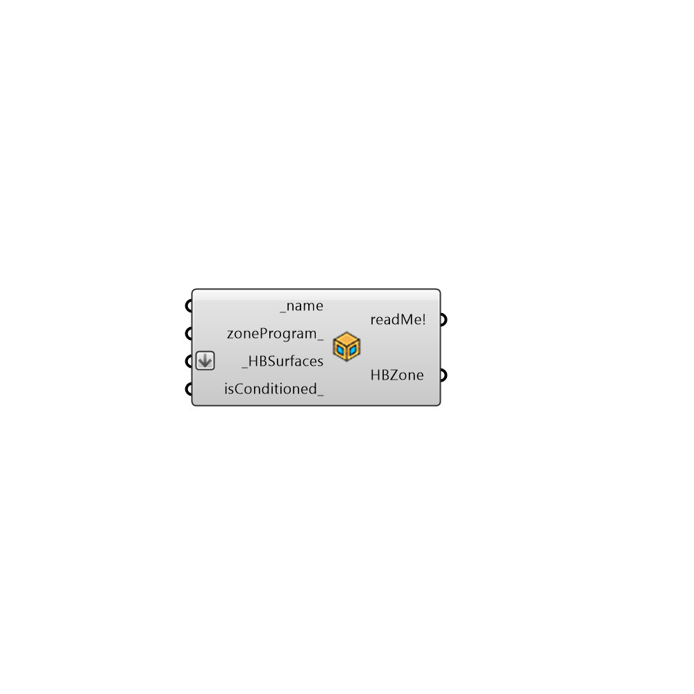

##  createHBZones

    Create an HBZone from HB Surfaces
 -
 

#### Inputs
* ##### name [Required]
The name of the zone as a string
* ##### zoneProgram [Optional]
Optional input for the program of this zone
* ##### HBSurfaces [Required]
A list of Honeybee Surfaces
* ##### isConditioned [Optional]
True/False value. This value will be applied to the ouput zone to either condition them with an Ideal Air Loads System (True) or not condition them at all (False). If no value is connected here, all zones will be conditioned with an Ideal Air Loads System by default.

#### Outputs
* ##### readMe!
...
* ##### HBZone
Honeybee zone as the result

[Check Hydra Example Files for createHBZones](https://hydrashare.github.io/hydra/index.html?keywords=Honeybee_createHBZones)