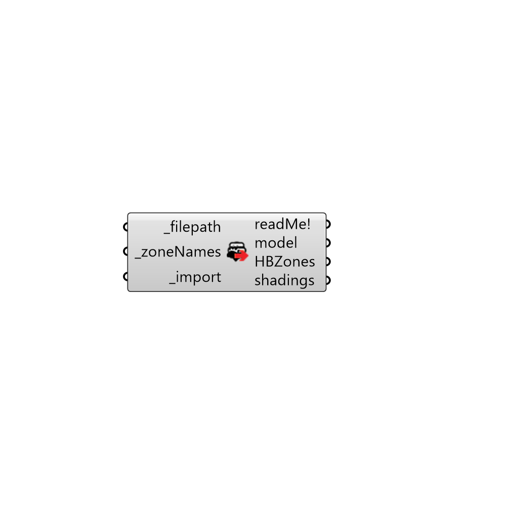

##  gbXML to Honeybee - [[source code]](https://github.com/mostaphaRoudsari/honeybee/tree/master/src/Honeybee_gbXML%20to%20Honeybee.py)

Import gbXML files as Honeybee zones.
 This component uses OpenStudio libraries to import the file and at this point
 the component imports geometry and constrcuctions(if available). Loads and schedules may 
 be added to the component eventually.
 You also need to solve adjacencies after importing the zones.
 -
 

#### Inputs
* ##### filepath [Required]
Full filepath to xml file.
* ##### zoneNames [Required]
The list of names for thermal zones that you want to be loaded
 from the file. By default the component will import all the zones.
* ##### import [Required]
Set to True to import the model.

#### Outputs
* ##### readMe!

* ##### model
OpenStudio model which is created from the gbXML file. This output
 will only be useful for advanced users to develop custom scipts.
* ##### HBZones
List of honeybee zones.
* ##### shadings
List of shading surfaces if any.

[Check Hydra Example Files for gbXML to Honeybee](https://hydrashare.github.io/hydra/index.html?keywords=Honeybee_gbXML to Honeybee)