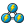
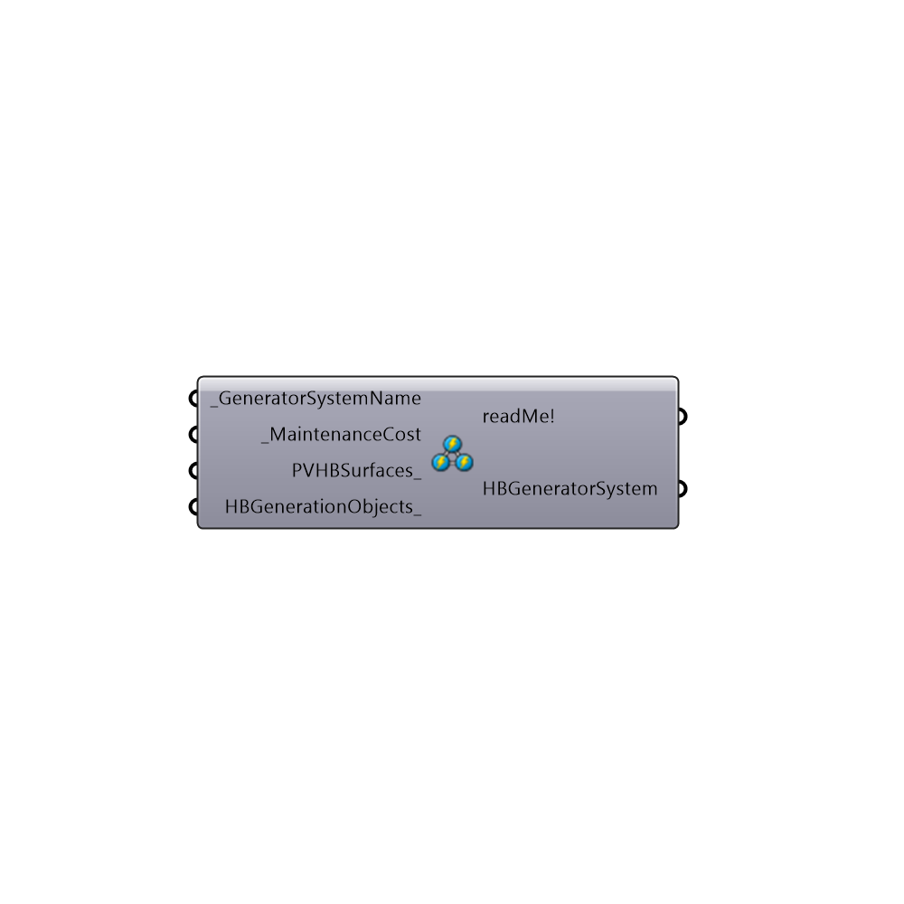

##  generationsystem

Use this component to create a Honeybee generator system.
 -
 

#### Inputs
* ##### GeneratorSystemName [Required]
The name of this Honeybee generation system please make it unique!
* ##### MaintenanceCost [Required]
The annual cost of maintaining this Honeybee generation system in US dollars (Other currencies will be available in the future)
* ##### PVHBSurfaces [Optional]
The Honeybee/context surfaces that contain PV generators to be included in this generation system
* ##### HBGenerationObjects [Optional]
Honeybee batteries or wind turbines to be included in this generation system 

#### Outputs
* ##### readMe!
The execution information, as output and error streams
* ##### HBGeneratorSystem
The Honeybee generation system - connect this to the input HB_generators on the Honeybee_Run Energy Simulation component to include this generation system in an EnergyPlus simulaton

[Check Hydra Example Files for generationsystem](https://hydrashare.github.io/hydra/index.html?keywords=Honeybee_generationsystem)