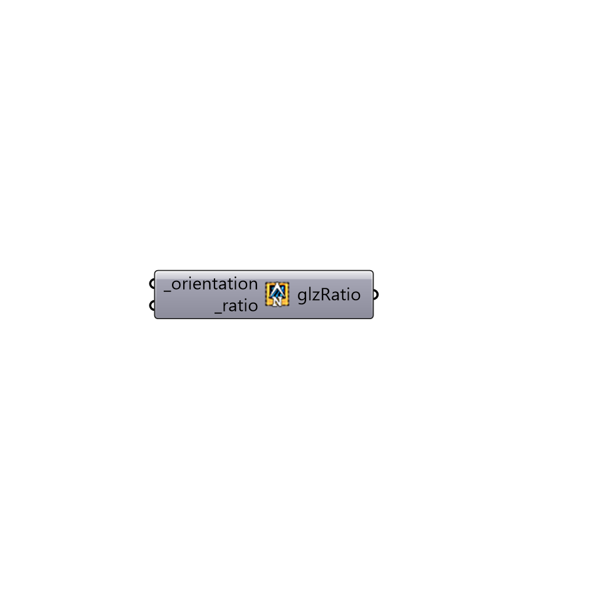

##  orientHBGlz - [[source code]](https://github.com/ladybug-tools/honeybee-legacy/tree/master/src/Honeybee_orientHBGlz.py)

Use this component to set the orientation(s) of the glazing.
 -
 

#### Inputs
* ##### orientation [Required]
The orientation/s that you'd like to add glazing to.
* ##### ratio [Required]
The window to wall ratio.

#### Outputs
* ##### glzRatio
A list of glazing orientations that can be plugged into (glazingCreator).

[Check Hydra Example Files for orientHBGlz](https://hydrashare.github.io/hydra/index.html?keywords=Honeybee_orientHBGlz)