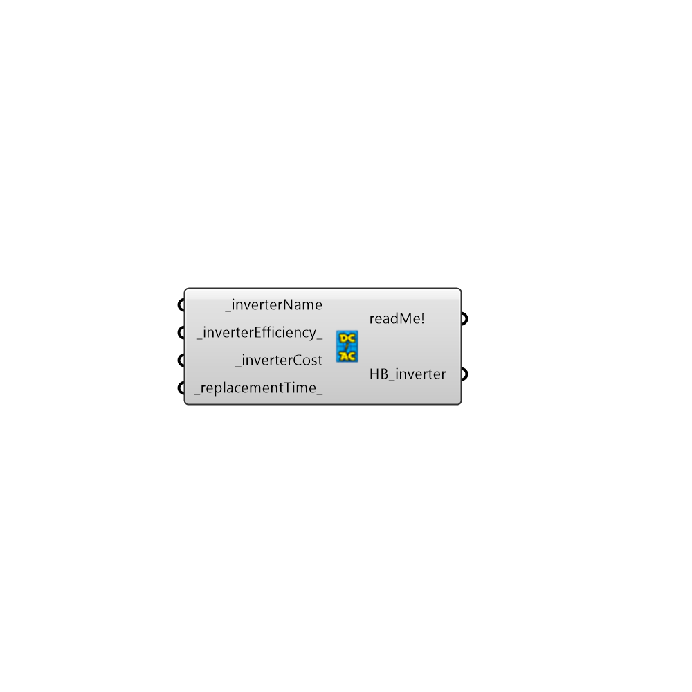

##  simple_Inverter

#### Inputs
* ##### inverterName [Required]
The inverter name - Make it unique from other inverters
* ##### inverterEfficiency [Default]
The efficiency of the inverter by default this is 90%
* ##### inverterCost [Required]
The cost of the inverter in US dollars (Other currencies will be available in the future)
* ##### replacementTime [Default]
Specify how often in years the inverter will need to be replaced. The default is 5 years.

#### Outputs
* ##### readMe!
The execution information, as output and error streams
* ##### HB_inverter
Honeybee inverter- to include this inverter in a generation system connect it to the input HB_generationobjects on the Honeybee_generationsystem component 

[Check Hydra Example Files for simple_Inverter](https://hydrashare.github.io/hydra/index.html?keywords=Honeybee_simple_Inverter)